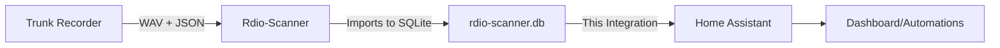

# Rdio-Scanner Home Assistant Integration

[](https://github.com/hacs/integration)
[](https://opensource.org/licenses/MIT)
[](https://github.com/tsquared96/ha-rdio-scanner/graphs/commit-activity)

A comprehensive Home Assistant integration for [Rdio-Scanner](https://github.com/chuot/rdio-scanner) that provides real-time police/fire/EMS radio monitoring with audio playback directly from the Rdio-Scanner database.

## 📻 Overview

This integration connects Home Assistant to your Rdio-Scanner SQLite database, providing access to:
- Live scanner audio stored as BLOBs in the database
- Call metadata and talkgroup information
- Real-time monitoring of new calls
- Historical call playback
- System and talkgroup statistics

### How It Works



1. **Trunk Recorder** records radio calls as WAV files with JSON metadata
2. **Rdio-Scanner** imports these files into its SQLite database
3. **This integration** reads the database to provide calls in Home Assistant
4. **You** can listen to calls, create automations, and build dashboards

## 🎬 Features

- **Direct Database Access** - Connects directly to rdio-scanner.db SQLite database
- **Audio Playback** - Stream recorded calls from database BLOBs
- **Real-time Updates** - Monitor new calls as they're imported
- **Remote Access** - Full functionality via Home Assistant remote access
- **Call Metadata** - Access talkgroup names, frequencies, units, and more
- **Statistics** - Track calls per system, talkgroup activity, and call volumes
- **Media Player** - Built-in media player entity for audio control
- **Automation Ready** - Trigger automations based on specific talkgroups or systems

## 📋 Prerequisites

- Home Assistant 2024.1.0 or newer
- Rdio-Scanner installation with SQLite database
- Access to the rdio-scanner.db file location
- Trunk Recorder feeding audio to Rdio-Scanner

## 🚀 Installation

### HACS Installation (Recommended)

1. Open HACS in Home Assistant
2. Click on "Integrations"
3. Click the three dots menu and select "Custom repositories"
4. Add this repository URL: `https://github.com/tsquared96/ha-rdio-scanner`
5. Select "Integration" as the category
6. Click "Add"
7. Search for "Rdio-Scanner" and install
8. Restart Home Assistant

### Manual Installation

1. Download the latest release from the [releases page](https://github.com/tsquared96/ha-rdio-scanner/releases)
2. Extract the `rdio_scanner` folder to your `custom_components` directory:
   ```
   custom_components/
   └── rdio_scanner/
       ├── __init__.py
       ├── manifest.json
       ├── config_flow.py
       └── ...
   ```
3. Restart Home Assistant

## ⚙️ Configuration

### Step 1: Add the Integration

1. Go to **Settings** → **Devices & Services**
2. Click **Add Integration**
3. Search for **Rdio-Scanner**
4. Enter configuration:
   - **Name**: Friendly name for the integration (e.g., "Scanner")
   - **Data Directory Path**: Path to Rdio-Scanner data directory (e.g., `/opt/rdio-scanner/data`)

The integration will look for `rdio-scanner.db` in the specified directory.

### Step 2: Verify Connection

After setup, you should see several new entities:
- `sensor.rdio_scanner_active_calls` - Number of recent calls
- `sensor.rdio_scanner_total_calls` - Total calls in recent history
- `sensor.rdio_scanner_systems` - Number of radio systems
- `sensor.rdio_scanner_talkgroups` - Number of talkgroups
- `media_player.rdio_scanner_player` - Audio playback control

## 🗄️ Database Structure

The integration reads from the Rdio-Scanner SQLite database with this structure:

### Primary Table: `rdio_scanner_calls`
- `id` - Unique call identifier
- `audio` - Audio data as BLOB (MP3 format)
- `audioName` - Original filename
- `audioType` - MIME type (usually audio/mpeg)
- `dateTime` - Timestamp in milliseconds
- `system` - System number
- `talkgroup` - Talkgroup ID
- `talkgroupData` - JSON with talkgroup details (label, tag, group)
- `frequency` - Frequency in Hz
- `frequencies` - JSON array of all frequencies used
- `sources` - JSON array of unit IDs
- `patches` - JSON array of patched talkgroups
- `len` - Call length in seconds

## 📊 Entities Created

### Sensors
- **Active Calls** - Calls from the last 30 seconds
- **Total Calls** - Recent call history count
- **Systems** - Number of unique systems
- **Talkgroups** - Number of unique talkgroups

Each sensor includes attributes with additional details like latest call information.

### Media Player
- **Rdio-Scanner Player** - Control audio playback
  - Play/pause/stop controls
  - Shows current talkgroup and system
  - Integrates with Home Assistant media controls

## 🎛️ Example Dashboards

### Basic Scanner Card
```yaml
type: vertical-stack
cards:
  - type: entities
    title: Scanner Status
    entities:
      - sensor.rdio_scanner_active_calls
      - sensor.rdio_scanner_total_calls
      - sensor.rdio_scanner_systems
      - sensor.rdio_scanner_talkgroups
  
  - type: media-control
    entity: media_player.rdio_scanner_player
```

### Call History Card
```yaml
type: markdown
title: Recent Calls
content: |
  
  **{{ call.talkgroup_name }}** - {{ call.timestamp }}
  Length: {{ call.call_length }}s - System {{ call.system }}
  
```

## 🤖 Automation Examples

### Alert on Emergency Talkgroup
```yaml
automation:
  - alias: "Scanner Emergency Alert"
    trigger:
      - platform: state
        entity_id: sensor.rdio_scanner_active_calls
    condition:
      - condition: template
        value_template: >
          {{ 'Fire Dispatch' in state_attr('sensor.rdio_scanner_total_calls', 'latest_talkgroup') }}
    action:
      - service: notify.mobile_app
        data:
          title: "Emergency Call"
          message: "Fire Dispatch active"
```

### Auto-Play New Calls
```yaml
automation:
  - alias: "Auto-play Scanner Calls"
    trigger:
      - platform: state
        entity_id: sensor.rdio_scanner_active_calls
    condition:
      - condition: numeric_state
        entity_id: sensor.rdio_scanner_active_calls
        above: 0
    action:
      - service: media_player.play_media
        target:
          entity_id: media_player.rdio_scanner_player
        data:
          media_content_type: music
          media_content_id: "{{ state_attr('sensor.rdio_scanner_total_calls', 'latest_call_id') }}"
```

## 🔧 Advanced Configuration

### Update Interval

The integration polls the database every 10 seconds by default. This can be adjusted in the coordinator if needed.

### Audio Caching

The integration caches up to 50 recent audio files in memory (under 10MB each) for faster playback.

### Remote Access

Audio playback works through Home Assistant's authentication system, so it's accessible remotely through:
- Nabu Casa Cloud
- VPN connection
- Reverse proxy setup

## 🐛 Troubleshooting

### Database Not Found
- Verify the path to rdio-scanner.db is correct
- Check file permissions (Home Assistant must have read access)
- Ensure Rdio-Scanner is running and importing calls

### No Audio Playback
- Check that audio BLOBs are being stored in the database
- Verify the media_player entity is created
- Check Home Assistant logs for errors

### No New Calls Appearing
- Verify Trunk Recorder is feeding calls to Rdio-Scanner
- Check Rdio-Scanner logs for import issues
- Ensure database isn't locked by another process

### Performance Issues
- Consider limiting the number of calls retrieved
- Check database size (consider archiving old calls)
- Ensure SQLite database is on fast storage (SSD recommended)

## 📝 Development

### Project Structure
```
custom_components/rdio_scanner/
├── __init__.py           # Integration setup and coordinator
├── manifest.json         # Integration metadata
├── config_flow.py        # Configuration UI
├── const.py             # Constants
├── rdio_db.py           # Database interface
├── sensor.py            # Sensor entities
├── media_player.py      # Media player entity
├── audio_handler.py     # Audio serving endpoint
└── translations/
    └── en.json          # UI translations
```

### Database Access

The integration uses `aiosqlite` for async database access:

```python
# Example: Getting audio from database
async def get_call_audio(call_id):
    query = "SELECT audio, audioType FROM rdio_scanner_calls WHERE id = ?"
    cursor = await conn.execute(query, (call_id,))
    row = await cursor.fetchone()
    return row['audio']  # Returns BLOB data
```

### Contributing

1. Fork the repository
2. Create a feature branch (`git checkout -b feature/amazing-feature`)
3. Commit your changes (`git commit -m 'Add amazing feature'`)
4. Push to the branch (`git push origin feature/amazing-feature`)
5. Open a Pull Request

## 📄 License

This project is licensed under the MIT License - see the [LICENSE](LICENSE) file for details.

## 🙏 Acknowledgments

- [Rdio-Scanner](https://github.com/chuot/rdio-scanner) by chuot
- [Trunk-Recorder](https://github.com/robotastic/trunk-recorder) by robotastic
- Home Assistant community for testing and feedback

## 💬 Support

- [Issue Tracker](https://github.com/tsquared96/ha-rdio-scanner/issues)
- [Discussions](https://github.com/tsquared96/ha-rdio-scanner/discussions)
- [Home Assistant Community Forum](https://community.home-assistant.io/)

## 🗺️ Roadmap

- [ ] Custom Lovelace card with waveform display
- [ ] WebSocket support for instant updates
- [ ] Call transcription display (if available)
- [ ] Advanced filtering by talkgroup/system
- [ ] Call export functionality
- [ ] Statistics dashboard
- [ ] Integration with police/fire department APIs
- [ ] Support for multiple Rdio-Scanner instances

## ⚠️ Disclaimer

This integration is not affiliated with or endorsed by the Rdio-Scanner or Trunk-Recorder projects. Use at your own risk. Ensure you comply with all local laws and regulations regarding radio monitoring and recording in your jurisdiction.

## 🌟 Star History

[](https://star-history.com/#tsquared96/ha-rdio-scanner&Date)

---

**Made with ❤️ for the Home Assistant and Scanner Communities**
